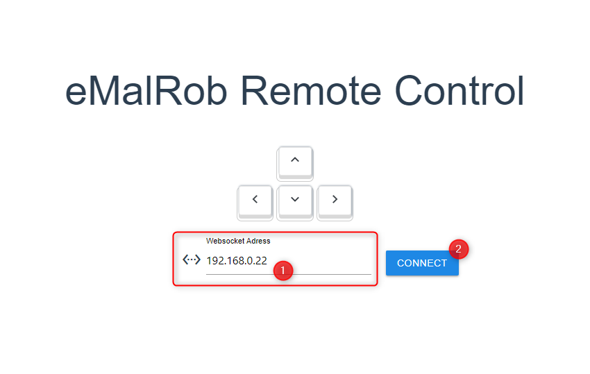

# eMalRob RC emF

Das Projekt besteht aus einer auf vue.js basierenden WebApp mit welcher sich eine WebSocket-Verbindung zu einem eMalRob aufbauen lässt.

Auf dem eMalRob selbst läuft ein Websocket-Server und eine Verarbeitung der eintreffenden Signal zur Ansteuerung der Motoren dies ist in Zusammenarbeit mit der Gruppe emW entstanden

http://www.hit-karlsruhe.de/hit-info/info-ss21/eMW/


# Starten der RC App

Im Ordner rc_app befindet sich die WebApp. Diese basiert auf vue.js, hierfür ist Node.js als Laufzeitumgebung notwendig

## Node.js

Verwendet wurde node.js 14.17.1 LTS.

https://nodejs.org/en/

## Project Setup

Um die WebApp zu starten muss man in einem Terminal-Fenster in den Ordner rc_app navigiert werden und zunächst
```
npm install
```
ausgeführt werden. NPM steht hierbei für Node Package Manager, dieser lädt nun alle notwendigen Pakete herunter. Dies muss nur einmal ausgeführt werden.


### Für Entwicklung

Für entwicklungszwecke lässt sich ein Development-Server starten.

```
npm run serve
```

### Für den Livebetrieb

Möchte man die App im Livebetrieb dauerhaft laufen lassen, können folgende befehle ausgeführt werden. Die App wird gebaut, optimiert und der Ordner *dist* erzeugt.

Bauen:
```
npm run build
```

Ausführen:
```
serve -s dist
```

Sollte der Befehl *serve* nicht gefunden werden, kann das Tool mit folgendem Befehl nachinstalliert werden.

```
npm install -g serve
```

Möchte man den Port beispielsweise auf Port 4000 ändern über welchen die App erreichbar ist kann man dies mit der Option *-l 4000* erreichen.

```
serve -s dist -l 4000
```

# WebSocker Server

Damit die Fernsteuerung funktionieren kann muss die Firmware im Ordner ESP32/RC_WebSocket_Server auf dem eMalRob aufgespielt werden. 

Im Quellcode der Firmware kann die SSID und das zugehörige Passwort eingetragen werden.

Für die Entwicklung wurde PlatformIO verwendet.

# Verbindungsaufbau

Um eine Verbindung mit einem eMalRob aufzubauen muss die IP-Adresse des eMalRob bekannt sein, diese wird einfach in das Eingabefeld(1) der WebApp eingetragen und auf Connect(2) geklickt.

*Hinweis: Mit der Taste F12 lässt sich in den meisten Browsern die Entwickleransicht öffnen, hier kann die korrekte Kommunikation noch einmal überprüft werden.*

<p align="center">
    
</p>